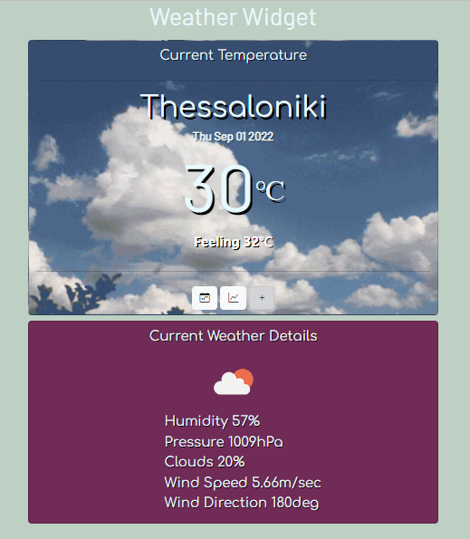

# Weather-Widget

## Description

A fully functional weather widget using data from an API.
* Current temperature
* Current weather details
* Seven days forecast
* Seven days max temperature chart 
 
---
## Preview

<b>⚠️One can only use the widget if they provide the correct API key⚠️</b>

---

## Setup

Steps to make the widget run:
* Git clone the repository
* Open HTML file (index.html) in browser
* Insert the correct API key

(No framework used, so nothing further needed)

---
## Details

Technologies used:
* HTML
* CSS
* JavaScript
* Bootstrap(5.2.0)
* jQuery(3.6.0)
* Chart.js(3.9.1)

  